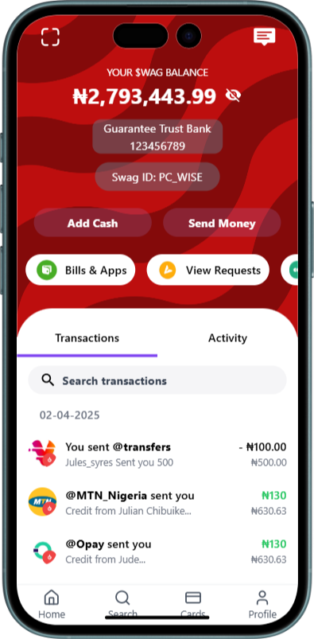
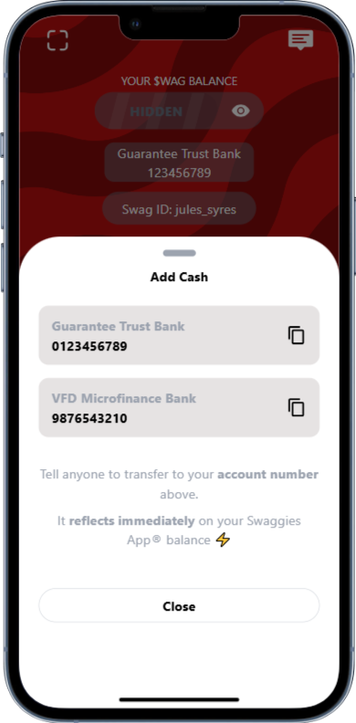

  

<h1 align="center">Swaggies</h1>

  <b>Swaggies by WackyDawg : Your playful 🎉 and wacky 🤪 companion for managing your finances with a smile 😊. Experience unique savings challenges 🎯, customizable avatars 🎨, and a world of financial fun 🎈, all wrapped up in a secure 🔒 and user-friendly mobile wallet app 📲. 
  Made with ❤️ by <a href="https://github.com/WackyDawg">Julian Nwadinobi(wackydawg)</a>

## Why Swaggies

Swaggies by WackyDawg is not your ordinary mobile wallet app. It's designed to make managing your finances fun, engaging, and, well, wacky! With a playful and user-friendly interface, unique savings challenges, and a few surprises up its sleeve, Swaggies is here to help you navigate your financial world with a smile.

## Features

- **Savings Challenges:** Take on quirky savings challenges that'll have you laughing all the way to the bank.
- **Customizable Avatars:** Personalize your wallet with wacky avatars and add a touch of your unique style.
- **Send and Receive Money:** Conveniently send and receive money, pay bills, and make purchases with a few taps on your mobile device.
- **Wacky Rewards:** Unlock unexpected rewards and bonuses, from funny animations to virtual stickers, just for using Swaggies regularly.
- **Financial Education:** Learn how to manage your finances wisely while having a blast with our educational resources and tips.
- **Top-Notch Security:** Swaggies ensures your financial information is kept secure and protected, so you can enjoy the wackiness with peace of mind.

## Getting Started

1. **Installation:** Download and install Swaggies by WackyDawg from your app store.
2. **Creating an Account:** Sign up and set up your Swaggies account.
3. **Get Wacky:** Explore the app, take on savings challenges, and customize your wallet.
4. **Manage Finances:** Use Swaggies to send money, pay bills, and stay on top of your finances with a smile.

## Support and Feedback

If you encounter any issues or have suggestions for making Swaggies even wackier, please contact our support team at [support@swaggieswackydawg.com](mailto:support@swaggieswackydawg.com).

## 🖼️ App UI Preview

  
  

  
  

## License

This project is licensed under the [MIT License](LICENSE) - see the [LICENSE](LICENSE) file for details.

## Acknowledgments

- Hat tip to the entire Swaggies by WackyDawg team for making finance fun.
- Inspired by the idea that personal finance can be engaging and enjoyable.

Thank you for choosing Swaggies by WackyDawg! We hope you enjoy using it as much as we enjoyed creating it.
